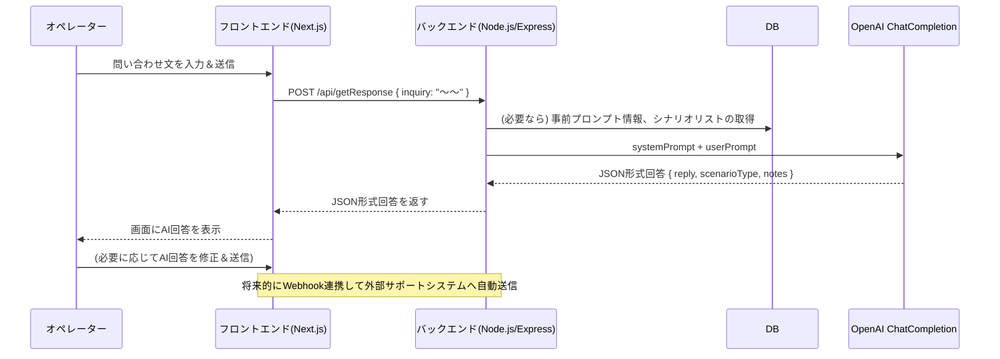

# customer_support

# Webアプリケーション設計書 Next.js

## 1. システム概要

### 1.1 システム名（仮）
AI共同型カスタマーサポート簡素化システム

### 1.2 システム概要
- カスタマーサポート対応時に、**OpenAIのChatCompletion API**を利用して返信候補を自動生成し、オペレーターが最終的な返信を行う形のWebアプリケーション。
- **systemプロンプト**に「事前マニュアル（会社情報・基本対応マニュアル等）」や「商品詳細（ECサイト向けの商品情報）」、および「シナリオリスト（定型的な返答例など）」をまとめて設定。
- **userプロンプト**にエンドユーザーからの問い合わせを入力すると、JSON形式の回答を受け取り、フロントエンド上で表示・編集・送信が可能になる。
- 後続フェーズでは、Webhook連携により外部チャットサポートツール等との自動連携を想定。

---

## 2. 要件

### 2.1 機能要件

1. **事前マニュアルプロンプト管理**  
   - **会社情報**（企業理念、コンプライアンス、対応方針 等）  
   - **返品ポリシー・保証内容**  
   - **その他サポート時に参照すべき共通情報**  
   - これらを管理画面から編集・保存でき、最終的にsystemプロンプトとしてまとめてAPI呼び出しに利用する。

2. **商品詳細プロンプト管理**  
   - ECサイトの商品ごとに、スペックや価格、FAQ、在庫状況、入荷予定などを管理。  
   - systemプロンプトに含め、ユーザー問い合わせ内容と照合しながら回答生成に活用する。

3. **シナリオリスト管理**  
   - よくある問い合わせに対する定型フレーズ（肯定的応答・否定的応答・納期回答 等）を登録し、systemプロンプトへ組み込む。  
   - AIには登録シナリオのほかに**追加のシナリオ案を自動生成**させるようにも指示する。

4. **問い合わせ（userプロンプト）入力画面**  
   - オペレーターがエンドユーザーの質問や要望をコピペまたは直接入力できるフォーム。  
   - 「送信」ボタン押下時にバックエンドを経由してOpenAIのAPIへリクエストを送る。

5. **AI回答（JSON形式）表示画面**  
   - JSONの `{"reply":"...", "scenarioType":"...", "notes":"..."}` を受け取り、フロント画面に表示。  
   - `reply`：AI提案の返信メッセージ  
   - `scenarioType`：選択したシナリオの種類やラベル（「納期回答」「肯定的回答」など）  
   - `notes`：オペレーター向けの注意点や補足情報

6. **オペレーター編集・送信機能**  
   - 表示されたAI提案メッセージをオペレーターが修正し、そのまま顧客に返信できるようにする（現時点ではメールやチャット画面へのコピペで対応しても可）。
   - 後々はWebhook連携により、外部のサポートツールへ直接送信することも想定。

7. **ログ・履歴管理（オプション）**  
   - どの問い合わせに対してAIがどのような回答案を返したかをDBに保存し、参照できるようにする。
   - 返信に対しての満足度評価などを行い、AIの学習やプロンプト修正に活用していく。

### 2.2 非機能要件

1. **セキュリティ**  
   - OpenAI APIキーはサーバーサイドで安全に管理し、フロントへ直接公開しない。
   - ユーザー問い合わせ文やログデータに機密情報が含まれる場合は、適切な暗号化やアクセス制御を行う。

2. **パフォーマンス**  
   - 大量アクセスが予想される場合は、OpenAI APIのレート制限を考慮し、キューイングやキャッシュを検討する。
   - レスポンス速度がビジネス要件を満たすよう、API呼び出し回数の削減やプロンプト最適化を行う。

3. **拡張性**  
   - Webhook連携や多言語対応、コールセンター音声連携など、将来的機能拡張を容易に行えるアーキテクチャを採用する。

---

## 3. システム構成図

```mermaid
flowchart LR
    subgraph Frontend [Next.jsなどのフロントエンド]
      UI[UI (問い合わせ入力画面/回答表示画面)]
    end

    subgraph Backend [Node.js/Expressなどのサーバー]
      API[REST APIエンドポイント]
      DB[(DB: プロンプト管理/ログ)]
    end

    subgraph OpenAI
      ChatCompletion[OpenAI ChatCompletion API]
    end

    UI -->|問い合わせ文| API
    API -->|system + user プロンプト| ChatCompletion
    ChatCompletion -->|JSON形式の回答| API
    API -->|JSONパース後、フロントへ送信| UI
    API -->|必要に応じて| DB
```

- **Frontend(Next.js)**:  
  - 管理画面：事前マニュアルプロンプト・商品詳細プロンプト・シナリオリストの編集ページ  
  - 問い合わせ入力画面：ユーザー問い合わせ文を入力し、AI回答( JSON ) を受け取るページ  
- **Backend(Node.js)**:  
  - **APIエンドポイント**: `/api/getResponse`など  
  - **DB**: プロンプト情報や問い合わせ履歴を保存（オプション）  
  - **OpenAIとの接続**: システムロール／ユーザーロールを組み立ててAPIリクエストし、返されたメッセージをフロントエンドへ返す  

---

## 4. データフロー / シーケンス図

### 4.1 シーケンス図例


---

## 5. 主要モジュール設計

### 5.1 システムプロンプト生成モジュール
- **目的**: DBや設定ファイルに保存された「会社情報・商品情報・シナリオリスト」等を統合し、`systemPrompt`文字列を動的に構築する。
- **処理概要**:
  1. DBまたは設定ファイルから必要な情報を取得  
  2. テンプレート文字列やマージ処理を用いて1つの大きなsystemPromptを生成  
  3. `OpenAI.createChatCompletion()`呼び出し時に、`{ role: "system", content: systemPrompt }` 形式で渡す  
- **考慮点**: トークン制限に注意し、長すぎるプロンプトは要約する仕組みを用意する。

### 5.2 問い合わせ処理モジュール
- **目的**: フロントエンドから受け取った問い合わせ文（userPrompt）をOpenAIへ送信し、JSON形式で結果を返す。
- **処理概要**:
  1. 事前に生成したsystemPromptと、ユーザー入力のuserPromptをまとめて`messages`配列にセット  
  2. `model`や`temperature`等のパラメータを指定してAPI呼び出し  
  3. APIのレスポンス(JSON形式の文字列)をパースし、フロントエンドへ返却  
- **考慮点**: JSONパース失敗時のフォールバック処理やエラー制御

### 5.3 シナリオリスト管理モジュール
- **目的**: 定型的なシナリオ（肯定的応答、否定的応答、納期回答など）をCRUD操作可能にする。
- **処理概要**:
  1. 管理画面で追加・編集されたシナリオをDBへ保存  
  2. システムプロンプト生成時にシナリオを読み込み、「シナリオの一覧」をsystemPromptへ付加  
  3. AIがこれらのシナリオをもとに、回答の一部として採用する  

---

## 6. 実装例（一部）

### 6.1 APIエンドポイント（Node.js/Express想定）
```typescript
import express, { Request, Response } from 'express';
import { Configuration, OpenAIApi } from 'openai';
import bodyParser from 'body-parser';

const app = express();
app.use(bodyParser.json());

const configuration = new Configuration({
  apiKey: process.env.OPENAI_API_KEY, 
});
const openai = new OpenAIApi(configuration);

app.post('/api/getResponse', async (req: Request, res: Response) => {
  try {
    const userPrompt = req.body.inquiry ?? "";
    
    // DB等から systemPrompt 用の文字列を組み立てる（ダミー例）
    const systemPrompt = `
あなたは当社のカスタマーサポート担当AIです。... (事前マニュアルプロンプトなど)
【シナリオリスト】
1. ...
...
以下のJSON形式で出力してください：
{
  "reply": "<最終的な返信メッセージ>",
  "scenarioType": "<シナリオの種類>",
  "notes": "<補足>"
}
`;

    const messages = [
      { role: 'system', content: systemPrompt },
      { role: 'user', content: userPrompt },
    ];

    const response = await openai.createChatCompletion({
      model: "gpt-3.5-turbo", 
      messages: messages,
      temperature: 0.7,
    });

    const aiMessage = response.data.choices[0]?.message?.content || "";
    res.json({ result: aiMessage });
  } catch (error) {
    console.error(error);
    res.status(500).json({ error: "AIエラーが発生しました" });
  }
});

app.listen(3000, () => {
  console.log('Server running on port 3000');
});
```

- **ポイント**:
  - `systemPrompt`に事前情報を詰め込み、`userPrompt`に問い合わせ文を入れる。  
  - AI側には「JSON形式で返す」よう指示しておく。  
  - 実際の返り値はテキストなので、フロント側で `JSON.parse` を試みるなどして取り扱う。

### 6.2 フロントエンド（Next.js想定）の呼び出し例
```tsx
// pages/inquiry.tsx
import React, { useState } from 'react';

export default function InquiryPage() {
  const [inquiry, setInquiry] = useState("");
  const [aiResponse, setAiResponse] = useState("");

  const handleSend = async () => {
    const res = await fetch('/api/getResponse', {
      method: 'POST',
      headers: { 'Content-Type': 'application/json' },
      body: JSON.stringify({ inquiry }),
    });
    const data = await res.json();

    // data.result には AIが返してきたJSON形式の文字列が入っている想定
    try {
      const parsed = JSON.parse(data.result);
      setAiResponse(parsed.reply || "No reply field");
    } catch (e) {
      setAiResponse("JSONパース失敗: " + data.result);
    }
  };

  return (
    <div>
      <h1>問い合わせフォーム</h1>
      <textarea
        value={inquiry}
        onChange={(e) => setInquiry(e.target.value)}
        placeholder="ユーザーからの問い合わせ内容を入力"
      />
      <button onClick={handleSend}>送信</button>
      <div>
        <h2>AI返信</h2>
        <p>{aiResponse}</p>
      </div>
    </div>
  );
}
```

---

## 7. セキュリティ・運用上の留意点

1. **APIキーの保管**  
   - OpenAIのAPIキーは`.env`などに保管し、ソース管理外にする。
   - フロントから直接呼び出すのは避け、必ずサーバー経由で呼び出す。

2. **機密情報の取り扱い**  
   - ユーザーが入力する問い合わせ内容に個人情報や決済情報が含まれないように注意喚起。
   - 必要に応じてログを暗号化、またはセンシティブな情報をマスクする。

3. **レート制限**  
   - 大量のリクエストが発生した場合に備え、OpenAI APIのレートリミットに抵触しないようにキューイングやキャッシュを行う。

---

## 8. 今後の拡張

1. **Webhook連携**  
   - ZendeskなどのカスタマーサポートツールやチャットツールにWebhookで接続し、問い合わせが発生したら自動的にAIが回答候補を生成・提案するフローを実現。

2. **AI回答の品質向上**  
   - 過去の問い合わせ内容や回答結果を学習データとしてフィードバックし、プロンプトエンジニアリングやカスタムモデル調整等を検討。

3. **多言語対応**  
   - グローバル展開を見据え、systemPromptに「回答は日本語でお願いします」「回答は英語でお願いします」など指定できるようにする。

4. **ログ分析・FAQ自動生成**  
   - よくある質問パターンをAIが自動抽出・生成し、商品詳細プロンプトやシナリオリストへ追加する仕組みを構築。

---

## 9. まとめ

本設計では、「事前に設定されたマニュアル情報や商品情報を**systemプロンプト**でAIに与え、ユーザーからの問い合わせを**userプロンプト**として受け付け、**JSON形式**の回答を取得して表示する」という基本フローを中心に据えています。将来的にはWebhook連携や多言語化、ログ分析を通じてサポートの品質向上や効率化が期待できます。

**AIと人間オペレーターが協力**する形を基本とし、定型対応は自動化、イレギュラー対応は人間が判断するといった柔軟な運用を実現することで、顧客満足度向上とサポートコストの削減を両立することを目指します。
