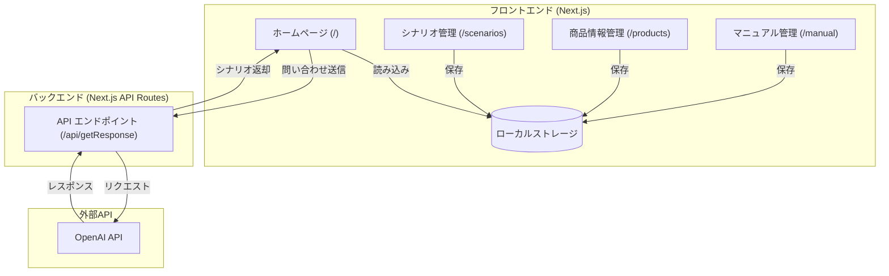
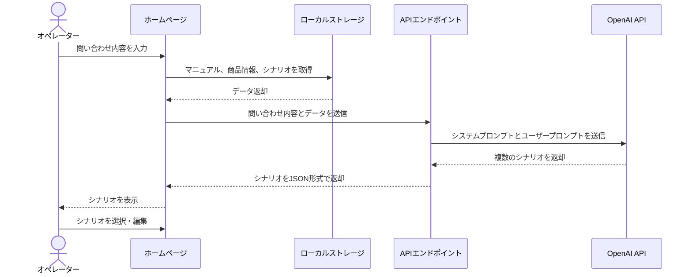
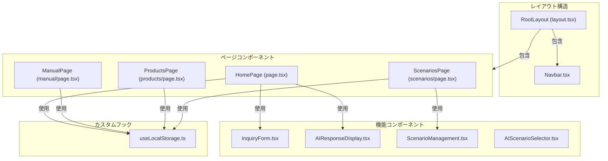
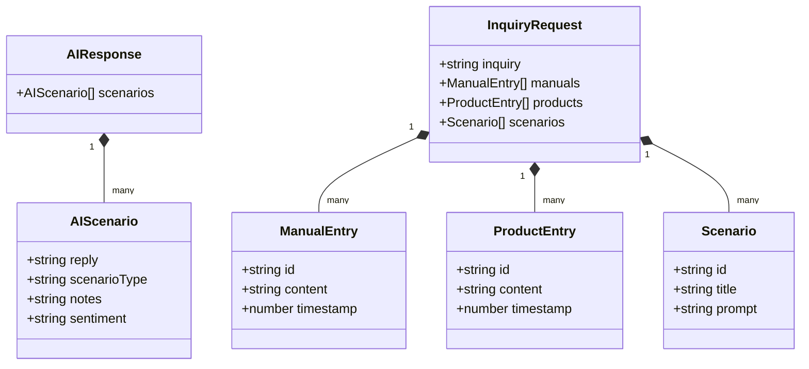

# カスタマーサポートアプリケーション データフロー図

## 1. 全体アーキテクチャ



## 2. 問い合わせ処理フロー



## 3. コンポーネント関係図



## 4. データモデル関係図



## 5. ページナビゲーション図

```mermaid
graph LR
    HomePage["ホームページ (/)"]
    ManualPage["マニュアル管理 (/manual)"]
    ProductsPage["商品情報管理 (/products)"]
    ScenariosPage["シナリオ管理 (/scenarios)"]
    
    HomePage -- "ナビゲーションバー" --> ManualPage
    HomePage -- "ナビゲーションバー" --> ProductsPage
    HomePage -- "ナビゲーションバー" --> ScenariosPage
    
    ManualPage -- "ナビゲーションバー" --> HomePage
    ManualPage -- "ナビゲーションバー" --> ProductsPage
    ManualPage -- "ナビゲーションバー" --> ScenariosPage
    
    ProductsPage -- "ナビゲーションバー" --> HomePage
    ProductsPage -- "ナビゲーションバー" --> ManualPage
    ProductsPage -- "ナビゲーションバー" --> ScenariosPage
    
    ScenariosPage -- "ナビゲーションバー" --> HomePage
    ScenariosPage -- "ナビゲーションバー" --> ManualPage
    ScenariosPage -- "ナビゲーションバー" --> ProductsPage